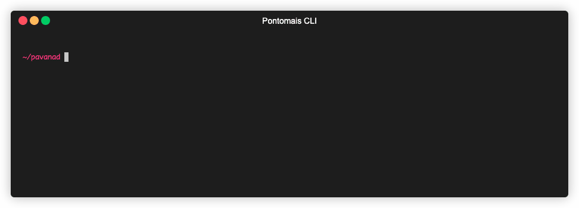

# Pontomais

> **Warning**
> Devido a falta de acesso a interface do Pontomais o projeto foi descontinuado, mas com pequenas alterações ainda pode ser utilizado.
> Sinta-se à vontade para utilizar o projeto e/ou modificá-lo para suas necessidades.

Projeto criado para facilitar a utilização do app pontomais com outras aplicações ou para o registro e a consulta dos pontos no dia a dia com a ferramenta de linha de comando.

A ideia é ter um modúlo que pode ser utilizado pelo cli ou integrando com outras aplicações potencializando as funcionalidades como por exemplo a integração com o Google Assistant (objetivo principal). 

## Como instalar

Sempre que uma nova versão for gerada será adicionada no diretório **/dist**.

Faça o download do repositório e instale usando o comando abaixo.

```bash
pip install dist/pontomais-0.1.3.tar.gz
```

Se preferir instalar manualmente use o gerenciador **poetry** ou simplesmente o **pip**.

```bash
poetry install
```
ou
```bash
pip install requirements.txt
```

## Como usar

Para utilizar o pacote em seu projeto importe a classe PontoMaisClient e utilize conforme abaixo:

```python
from pontomais.api.client import PontoMaisClient

pontomais = PontoMaisClient()
pontomais.set_credentials(<username>, <password>)

# a localização é necessária para o registro do ponto
# a latitude e a longitude podem ser obtidas pelo Google Maps
pontomais.set_location(<address>, <latitude>, <longitude>)
pontomais.authenticate()

# retorna os horários registrados no dia
current_work_day = pontomais.current_work_day()

# retorna os horários da data definida
work_day = pontomais.workday("2021-03-22")

# faz o registro do ponto no app Pontomais
register_info = pontomais.register()
```

Para utilizar a ferramenta de linha de comando veja os exemplos abaixo:

**Comandos disponíveis**

```bash
USAGE
  pontomais [-h] [-q] [-v [<...>]] [-V] [--ansi] [--no-ansi] [-n] <command> [<arg1>] ... [<argN>]

ARGUMENTS
  <command>              The command to execute
  <arg>                  The arguments of the command

GLOBAL OPTIONS
  -h (--help)            Display this help message
  -q (--quiet)           Do not output any message
  -v (--verbose)         Increase the verbosity of messages: "-v" for normal output, "-vv" for more verbose output and "-vvv"
                         for debug
  -V (--version)         Display this application version
  --ansi                 Force ANSI output
  --no-ansi              Disable ANSI output
  -n (--no-interaction)  Do not ask any interactive question

AVAILABLE COMMANDS
  about                  Shows information about pontomais cli
  configure              This command set up API credentials and the address used in the pontomais
  help                   Display the manual of a command
  proxy                  If you need to use a proxy, you can configure using this command
  register               Register on time card
  workday                Get information about the work day
```

**Sobre a ferramenta**



**Configurando a ferramenta com suas credenciais**


**Configurando proxy**

Caso precise configurar um proxy da empresa que está trabalhando tente usar o comando abaixo:


**Consultando os pontos registrados em uma data**


**Registrando o ponto**


